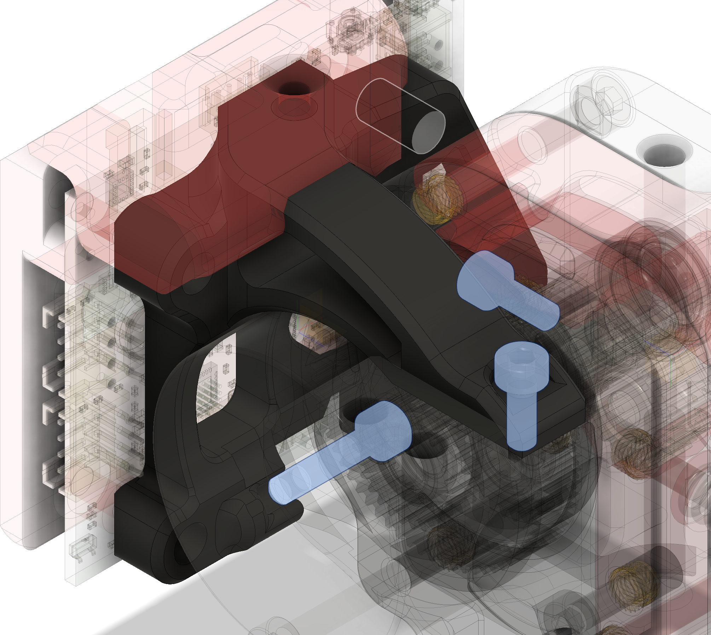

# Mount for a Duet 1LC V1.1

## Printing
* All STLs are in their intended print orientation

## Compatibility
* Tested with LDO-36STH20-1004AHG
* Duet3D Toolboard 1LC V1.1 

## Mounting
* The mount hooks onto the extension of the bottom motor screw (use M3x16) and screws into the cable cover heatset as well as in a heatest on the cable chain mount.

